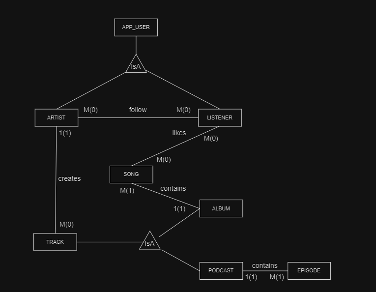

# Music-App

## Brief Description  
The app attempts to serve as a music platform such as Spotify or
YouTube Music. It provides two perspectives, the one of an artist
that can upload albums of songs or podcasts with multiple episodes,
and one of a regular listener that can tune in to the content provided
on the platform and like a few songs

## E/R Diagram

## Actions briefly
### Artist 
  - update his own profile
  - create/delete a new track (album/podcast)
  - add new contents to a track
### Listener
  - listen to songs/podcasts
  - add songs to a queue
  - view liked songs

> [!NOTE]  
> All the actions regarding the database are documented in the audit.csv file, including the caught errors 